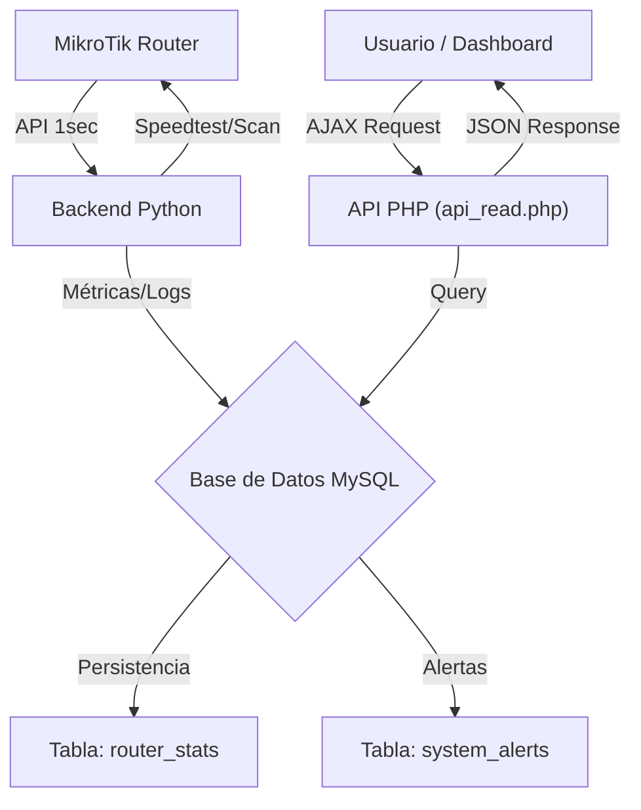

# DOCUMENTACIÓN TÉCNICA - REN Enterprise Monitor v2.1

Esta guía profundiza en el funcionamiento interno del sistema, los esquemas de datos y los flujos de comunicación.

## 1. Arquitectura del Sistema

El sistema sigue una arquitectura de tres capas:

1. **Capa de Recolección (Backend Python)**: Se conecta al MikroTik y recolecta métricas cada 1 segundo.
2. **Capa de Datos (API PHP + MySQL)**: Recibe, procesa y almacena la telemetría. Gestiona alertas automáticas.
3. **Capa de Visualización (Dashboard HTML5)**: Consulta la API para mostrar gráficos y estados en tiempo real.

### Diagrama de Flujo

## 2. Motor de Telemetría (Python)

El archivo `ren_monitor_backend.py` realiza las siguientes tareas:

- **Frecuencia de Muestreo**: 1 segundo (ajustable en el bucle principal).
- **Cálculo de Tráfico**: Calcula la diferencia de bytes entre muestras para obtener bps (bits por segundo) reales por interfaz.
- **Tareas Programadas**:
  - **Speedtest**: Ejecución cada 1 hora (`last_speedtest > 3600`).
  - **Escaneo de Red**: Ejecución cada 5 minutos (`last_scan > 300`) para detectar dispositivos nuevos en ARP/DHCP.
  - **Caché de VPN**: Actualiza la relación usuario/perfil cada 60 segundos.

## 3. Esquema de Base de Datos (MySQL)

### Tabla: `router_stats`

Almacena el historial de rendimiento. Campos clave:

- `cpu_load`, `free_memory`, `temperature`, `voltage`.
- `wan1_rx/tx`, `wan2_rx/tx` (en bps calculados).
- `ping_avg_ms`, `ping_loss_percent`.
- `vpn_profiles_detail` (JSON): Almacena cuántos usuarios hay por cada perfil (ej: { "VIP": 3, "Standard": 10 }).

### Tabla: `system_alerts`

Generada automáticamente por `api_ingest.php`:

- **Crítica**: Pérdida de paquetes > 50% o caídas de WAN.
- **Advertencia**: Latencia > 150ms o CPU > 90%.

## 4. Referencia de la API (`api_read.php`)

La API de lectura acepta el parámetro `mode`:

- `mode=live`: Retorna los últimos 60 registros (ideal para gráficos de tiempo real).
- `mode=history&start=YYYY-MM-DD&end=YYYY-MM-DD`: Retorna el historial entre fechas (máx 5000 filas).
- `mode=alerts`: Retorna las últimas 20 alertas de sistema.
- `mode=speedtest`: Retorna los últimos 10 resultados de velocidad real.
- `mode=devices`: Retorna la lista de dispositivos que están actualmente online.

## 5. Seguridad y Rendimiento

- **Debounce de Alertas**: El sistema evita saturar la base de datos procesando solo alertas significativas.
- **Optimización de Gráficos**: El dashboard usa `Chart.js` con animaciones optimizadas para no sobrecargar el navegador en modo 24/7.
- **Modo NOC**: Desliza el dashboard hacia arriba y expande los KPIs para visibilidad a 5 metros de distancia.

## 6. Gestión de Logs e Integración Rsyslog

El sistema cumple con el requerimiento de centralización de logs de dos maneras:

1. **Polling via API**: El motor de Python extrae los últimos logs del MikroTik y los adjunta al payload.
2. **Rsyslog (Configuración Recomendada)**:
   - En el MikroTik: `/system logging action add name=syslog-server remote=IP_DEL_SERVIDOR target=remote`.
   - En el MikroTik: `/system logging add action=syslog-server topics=info,warning,error`.
   - Esto permite que los logs fluyan hacia un recolector centralizado mientras el Monitor REN gestiona las alertas críticas.

## 7. Automatización de Despliegue (Replicación)

El sistema incluye herramientas para facilitar su replicación en nuevos entornos:

- **`setup_db.py`**: Script en Python que automatiza la creación del esquema de base de datos (`ren_monitor`), gestionando la conexión inicial y la ejecución de `database_complete.sql`.
- **`repair_system.bat`**: Script batch que no solo reinicia servicios, sino que actúa como **instalador**, copiando todos los archivos del código fuente (incluyendo `img/` y dashboard) al directorio `htdocs` de XAMPP.
- **Personalización de Marca**: El sistema busca `img/logo.png` para mostrar el logotipo corporativo en el encabezado.

## 8. Verificación de Requerimientos (Checklist de Aceptación)

| Criterio | Estado | Detalle Técnico |
| :--- | :---: | :--- |
| **Ancho Banda Real (Claro)** | ✅ | Test de velocidad programado via `speedtest-cli`. |
| **Consumo Red Oficina** | ✅ | Monitoreo en tiempo real de interfaces LAN/WAN. |
| **Consumo VPN** | ✅ | Desglose por perfiles (L2TP, OVPN, SSTP, PPTP). |
| **Inventario de Dispositivos** | ✅ | Escaneo automático de ARP y DHCP leases. |
| **Usuarios Top Consumers** | ✅ | Ranking de IPs con mayor tráfico Rx/Tx por segundo. |
| **Alertas de Caída** | ✅ | Notificación por 'WAN Drops' o pérdida de ping. |
| **Alertas Inusuales** | ✅ | Disparadores por >50Mbps o >100 dispositivos. |
| **Gráficas y Dashboards** | ✅ | Dashboard empresarial con mapas de calor y KPIs. |
| **Reportes Exportables** | ✅ | Funcionalidad de exportación a PDF y CSV incluida. |

---
*Documento Final de Entrega - Proyecto REN Enterprise Monitor.*
